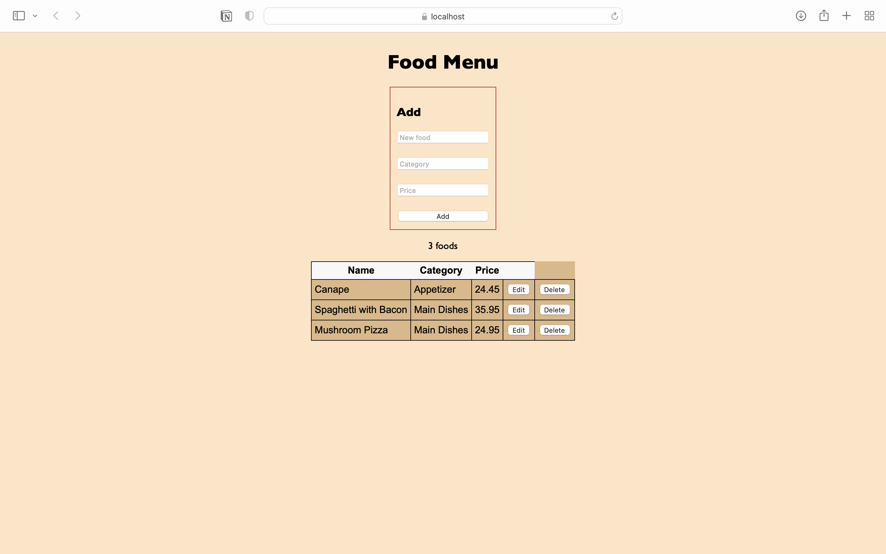

## Description

>FoodMenu is a web application that allows users to add food items into a table

    

## Features

- Add new food items with name, category, and price.
- View a list of all added food items.

## Technologies Used

- **Backend:** C#, ASP.NET Core
- **Frontend:** HTML, CSS, JavaScript

